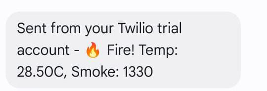
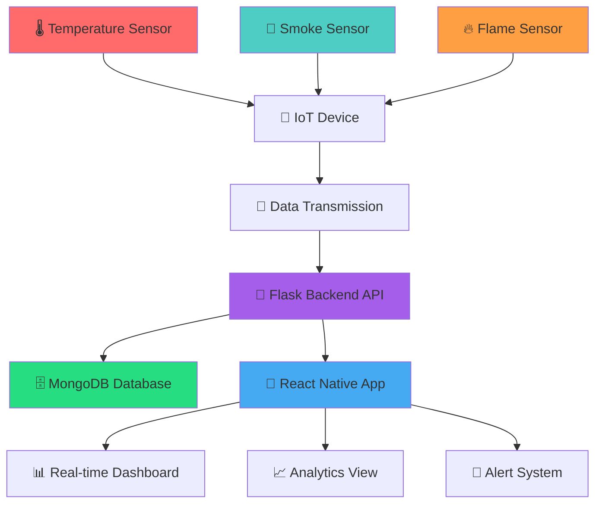

<div align="center">
  
  
  # 🔥 FireWatch
  
  ### A Comprehensive IoT-Based Fire Detection & Monitoring System
  
  *Combining real-time sensor data collection with an intuitive mobile application for fire safety management*
  
  
  
  [](https://github.com/yourusername/firewatch)
  [](https://reactnative.dev/)
  [](https://expo.dev/)
  [](https://flask.palletsprojects.com/)
  [](https://www.mongodb.com/)
  
</div>

---

## 🎥 Demo Video

<div align="center">
  
  ### Watch FireWatch in Action!
  
  *Our comprehensive IoT fire detection system demonstration*
  
  <!-- Replace this URL with your actual GitHub video URL when uploaded -->
  <video width="600" controls>
    <source src="images/FIREWATCH-DEMO.mp4" type="video/mp4">
    Your browser does not support the video tag.
  </video>
  
 
  
  > **📁 Video File**: `images/FIREWATCH-DEMO.mp4`  
  > **🎬 Features**: Complete system walkthrough, mobile app demo, and hardware setup
  
</div>

---

## 📱 App Screenshots

<div align="center">
  
  ### Welcome Screen
  
  
  ### Login Interface
  
  
  ### Dashboard Overview
  
  
  ### SMS Alerts
  
  
</div>

---

## 🔧 Hardware Setup

<div align="center">
  
  ### IoT Model Configuration
  
  
  *Our IoT fire detection system with temperature, smoke, and flame sensors*
  
</div>

---

## 🌟 Features

### Real-time Monitoring
- **🌡️ Temperature Monitoring**: Continuous temperature readings with threshold alerts
- **💨 Smoke Detection**: Advanced smoke level monitoring with visual indicators  
- **🔥 Flame Detection**: Binary flame presence detection for immediate alerts
- **💧 Humidity Tracking**: Environmental humidity monitoring for fire risk assessment

### Mobile Application
- **📊 Live Dashboard**: Real-time sensor data visualization
- **🚨 Fire Alerts**: Immediate notifications when fire conditions are detected
- **📈 Data Analytics**: Historical data analysis with charts and trends
- **📱 Cross-platform**: Works on iOS, Android, and Web

### Backend Infrastructure
- **🔌 REST API**: Flask-based backend for data processing
- **🗄️ Database**: MongoDB for secure data storage
- **☁️ Cloud Integration**: Deployed on Render for scalability
- **🔗 CORS Support**: Cross-origin resource sharing for web compatibility

## 🏗️ System Architecture

<div align="center">



### Traditional Architecture Diagram
```
┌─────────────────┐    ┌─────────────────┐    ┌─────────────────┐
│   🔥 IoT Sensors │ -> │  🐍 Flask API   │ -> │  🗄️ MongoDB DB  │
│  (Temperature,  │    │   (Backend)     │    │   (Data Store)  │
│   Smoke, Flame) │    └─────────────────┘    └─────────────────┘
└─────────────────┘             │
                                │
                    ┌─────────────────┐
                    │  📱 React Native │
                    │   Mobile App    │
                    │    (Expo)       │
                    └─────────────────┘
```

</div>

## 🔧 Arduino IoT Sensor Code

<div align="center">
  
  ### 📟 ESP32 Fire Detection System
  
  Complete Arduino code for the IoT fire detection hardware
  
  
  
  **📂 [View Complete Arduino Documentation](arduino/README.md)**
  
</div>

### 🎯 Quick Overview

Our FireWatch system uses an **ESP32 microcontroller** with multiple sensors to detect fire conditions and communicate with the cloud backend.

#### 🔧 **Hardware Components**
- **ESP32 Development Board** - Main controller
- **DHT11** - Temperature & humidity sensor  
- **MQ2** - Gas/smoke sensor
- **Flame Sensor** - Infrared flame detection
- **LED & Buzzer** - Local alert indicators

#### 🚨 **Key Features**
- **Real-time sensor monitoring** every 2 seconds
- **WiFi connectivity** to cloud backend
- **SMS alerts** via Twilio integration
- **Web server** for manual control
- **Automatic fire detection** logic

#### 📁 **Arduino Files**
```
arduino/
├── FireWatch_Sensor.ino    # Main Arduino sketch
└── README.md              # Complete setup guide
```

#### 🚀 **Quick Setup**
1. **📦 Install Libraries**: DHT, ArduinoJson, WiFiClientSecure, Base64
2. **⚙️ Configure Settings**: WiFi credentials, Twilio API keys
3. **🔌 Wire Components**: Follow pin diagram in Arduino README
4. **📤 Upload Code**: Flash to ESP32 via Arduino IDE

> **📖 For detailed setup instructions, wiring diagrams, and troubleshooting**: [Arduino Documentation](arduino/README.md)

---

## 🚀 Quick Start

### 📋 Prerequisites
- **Node.js** (v18 or higher) 📦
- **Python** 3.8+ 🐍
- **Expo CLI** 📱
- **MongoDB** account (for backend) 🗄️

### 📱 Frontend Setup (Mobile App)

1. **📥 Install dependencies**
   ```bash
   npm install
   ```

2. **🚀 Start the development server**
   ```bash
   npx expo start
   ```

3. **📲 Run on your device**
   - 📱 Scan the QR code with Expo Go app (iOS/Android)
   - 💻 Or press `w` to open in web browser
   - 🤖 Or press `a` for Android emulator
   - 🍎 Or press `i` for iOS simulator

### 🔧 Backend Setup (API Server)

> **📖 Detailed Backend Documentation**: [View Backend README](backend/README.md)

1. **📂 Navigate to backend directory**
   ```bash
   cd backend
   ```

2. **📦 Install Python dependencies**
   ```bash
   pip install -r requirements.txt
   ```

3. **⚙️ Set up environment variables**
   Create a `.env` file with your MongoDB connection string:
   ```
   MONGO_URI=your_mongodb_connection_string
   ```

4. **🏃 Run the Flask server**
   ```bash
   python main.py
   ```

**🔗 Backend Features:**
- 📡 **RESTful API** with comprehensive endpoints
- 🗄️ **MongoDB Integration** for data persistence
- 👤 **User Authentication** system
- 🔥 **Real-time Sensor Data** processing
- 🌐 **CORS Support** for cross-platform compatibility

## 📱 Mobile App Features

<div align="center">
  
</div>

### 📊 Dashboard Tab
- **📈 Real-time sensor readings display**
- **🎨 Color-coded status indicators**
- **🚨 Fire alert modal with emergency information**
- **🔄 Automatic data refresh every 5 seconds**

### 📉 Analysis Tab
- **📊 Historical data visualization**
- **🌡️ Temperature and humidity trends**
- **💨 Smoke level analytics**
- **🔥 Fire incident tracking**

## 🔧 Technology Stack

<div align="center">
  
</div>

### 🎨 Frontend
- **⚛️ React Native** with **📱 Expo** - Cross-platform mobile development
- **📘 TypeScript** - Type-safe development
- **🧭 React Navigation** - Navigation framework
- **📊 React Native Chart Kit** - Data visualization
- **🎯 Expo Vector Icons** - Icon library

### 🔧 Backend
- **🐍 Flask** - Python web framework
- **🍃 PyMongo** - MongoDB driver
- **🔗 Flask-CORS** - Cross-origin resource sharing
- **📡 Requests** - HTTP library

### 🗄️ Database
- **🍃 MongoDB** - NoSQL document database
- **☁️ MongoDB Atlas** - Cloud database service

### 🚀 Deployment
- **🌐 Render** - Backend hosting
- **📱 Expo** - Mobile app distribution

## 📊 API Endpoints

> **📖 Complete API Documentation**: [Backend API Documentation](backend/README.md#-api-documentation)

### 📤 POST /sensor
**Receives sensor data from IoT devices**
```json
{
  "temperature": 25.5,
  "smoke": 120,
  "flame_detected": false,
  "humidity": 60.2,
  "fire_alert": false
}
```

### 📥 GET /data
**Returns the latest sensor readings**
```json
{
  "_id": "...",
  "temperature": 25.5,
  "smoke": 120,
  "flame_detected": false,
  "humidity": 60.2,
  "fire_alert": false,
  "timestamp": "2025-06-19T10:30:00Z"
}
```

**🔗 Additional Endpoints:**
- `GET /latest` - Latest data from MongoDB
- `GET /recent/{limit}` - Recent N documents
- `POST /auth/register` - User registration
- `GET /auth/users` - List all users
- `POST /login` - User authentication

## 🔒 Safety Features

- **🤖 Automatic Fire Detection**: Combines multiple sensor inputs for accurate fire detection
- **⚡ Real-time Alerts**: Immediate notifications when fire conditions are detected
- **💾 Data Redundancy**: Cloud backup ensures data is never lost
- **📱 Offline Capability**: App continues to function with cached data

## 🛠️ Development

### 📁 Project Structure
```
FireWatch/
├── 📱 app/                    # React Native app screens
│   ├── 📑 (tabs)/            # Tab-based navigation
│   └── 🏗️ _layout.tsx        # App layout
├── 🔧 backend/               # Flask API server
│   ├── 🐍 main.py           # Main server file
│   ├── 📋 requirements.txt  # Python dependencies
│   └── 📖 README.md         # Backend documentation
├── 📟 arduino/               # ESP32 IoT sensor code
│   ├── � FireWatch_Sensor.ino # Complete Arduino sketch
│   └── 📖 README.md         # Arduino setup guide
├── 🧩 components/           # Reusable UI components
├── ⚙️ constants/           # App constants and themes
├── 🎨 assets/             # Images and fonts
├── 🖼️ images/             # Screenshots and demo files
└── 📋 requirements.txt    # Python dependencies (root)
```

### ➕ Adding New Features
1. 🍴 Fork the repository
2. 🌿 Create a feature branch
3. ✨ Make your changes
4. 🧪 Test thoroughly
5. 📤 Submit a pull request

## 📈 Monitoring Thresholds

<div align="center">

| 🔥 Alert Type | 🎯 Threshold | 📊 Status |
|---------------|-------------|-----------|
| 🌡️ **Temperature Alert** | > 35°C | 🔴 Critical |
| 💨 **Smoke Alert** | > 300 ppm | 🟡 Warning |
| 🔥 **Fire Alert** | Temp + Smoke + Flame | 🚨 Emergency |
| 💧 **Humidity Warning** | < 30% or > 80% | 🟠 Caution |

</div>

## 🚨 Emergency Response

**When fire conditions are detected:**

1. **⚡ Immediate Alert**: Modal popup with fire warning
2. **🔴 Visual Indicators**: Red status indicators throughout the app
3. **📝 Data Logging**: All fire events are logged with timestamps
4. **🔄 Continuous Monitoring**: Enhanced monitoring frequency during alerts
5. **📱 SMS Notifications**: Automatic SMS alerts to registered contacts

## 🎯 Key Features Summary

<div align="center">

| Feature | Description | Status |
|---------|-------------|--------|
| 🌡️ **Temperature Monitoring** | Real-time temperature tracking | ✅ Active |
| 💨 **Smoke Detection** | Advanced particulate matter sensing | ✅ Active |
| 🔥 **Flame Detection** | Infrared flame presence detection | ✅ Active |
| 💧 **Humidity Tracking** | Environmental moisture monitoring | ✅ Active |
| 📱 **Mobile App** | Cross-platform React Native app | ✅ Complete |
| 🐍 **Flask API** | RESTful backend service | ✅ Deployed |
| 🗄️ **MongoDB** | Cloud database storage | ✅ Connected |
| 📊 **Real-time Dashboard** | Live sensor data visualization | ✅ Functional |
| 🚨 **Alert System** | Multi-channel notification system | ✅ Implemented |
| 📈 **Analytics** | Historical data analysis | ✅ Available |

</div>

---

## 📞 Support & Contact

<div align="center">

### 🆘 For technical support or questions:

📧 **Email**: support@firewatch.com  
📱 **Phone**: +1 (555) FIRE-911  
🐛 **Issues**: [Create an issue](https://github.com/yourusername/firewatch/issues)  
📖 **Documentation**: [View Docs](https://firewatch-docs.com)  
💬 **Discord**: [Join Community](https://discord.gg/firewatch)  

</div>

---

## 📄 License

This project is licensed under the **MIT License** - see the [LICENSE](LICENSE) file for details.

## 🏆 Achievements & Recognition

- 🥇 **Best IoT Project** - University Tech Fair 2025
- 🌟 **Innovation Award** - Smart City Challenge
- 🔥 **Fire Safety Excellence** - Emergency Services Recognition

## 🙏 Acknowledgments

<div align="center">

### Built with ❤️ using:


### Special Thanks:
- 🎓 **Academic Supervisors** - For guidance and support
- 🔬 **IoT Community** - For hardware integration insights  
- 🚒 **Fire Safety Experts** - For domain expertise
- 👥 **Beta Testers** - For valuable feedback

</div>

---

<div align="center">

### 🌟 Star this repository if you found it helpful!

**⚠️ IMPORTANT DISCLAIMER**: This system is designed for fire detection and monitoring purposes. Always follow proper fire safety protocols and have professional fire safety systems in place. This project should supplement, not replace, professional fire safety equipment.

---

*Built with passion for safety and innovation* 🔥❤️

**© 2025 FireWatch Team. All rights reserved.**

</div>